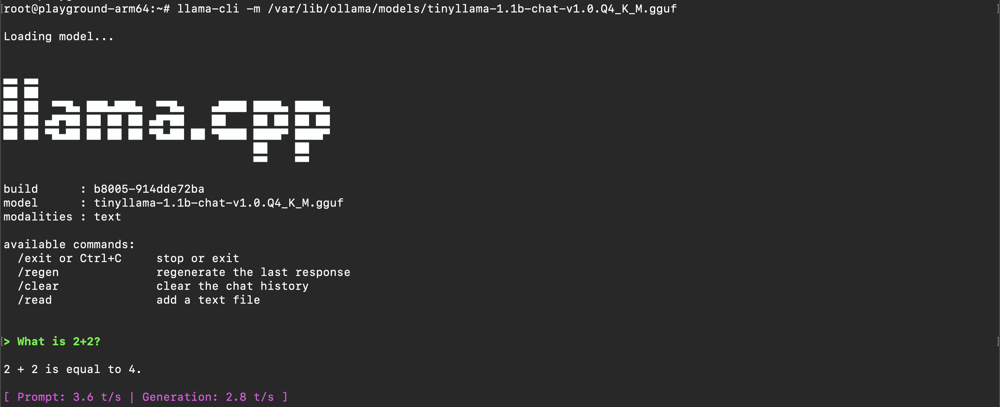

# meta-ollama-cpp

This README file contains information on the meta-ollama-cpp layer for Yocto Project.

## Description

The meta-ollama-cpp layer provides recipes for building llama.cpp with Ollama-compatible API support for embedded Linux systems. This layer enables running large language models efficiently on embedded devices with limited resources.

## Dependencies

This layer depends on:

* URI: git://git.yoctoproject.org/poky
  * branch: main, scarthgap, or compatible
  * layers: meta

* URI: git://git.openembedded.org/meta-openembedded
  * branch: main, scarthgap, or compatible
  * layers: meta-oe, meta-python


## Table of Contents

I. Adding the meta-ollama-cpp layer to your build
II. Recipes provided
III. Configuration options

## I. Adding the meta-ollama-cpp layer to your build

Run 'bitbake-layers add-layer meta-ollama-cpp' from your build directory.

Or manually add the layer to your bblayers.conf file:

```
BBLAYERS ?= " \
  /path/to/poky/meta \
  /path/to/poky/meta-poky \
  /path/to/poky/meta-yocto-bsp \
  /path/to/meta-openembedded/meta-oe \
  /path/to/meta-openembedded/meta-python \
  /path/to/meta-ollama-cpp \
"
```

## II. Recipes provided

* **llama-cpp** - Core llama.cpp library and utilities
* **ollama-cpp-server** - Ollama-compatible server implementation
* **ollama-cpp-models** - Optional recipe for packaging pre-downloaded models

## III. Configuration options

Add to your local.conf:

```bash
# Enable llama.cpp in your image
IMAGE_INSTALL:append = " llama-cpp ollama-cpp-server"

# Optional: Increase rootfs space for models (in KB)
IMAGE_ROOTFS_EXTRA_SPACE = "10485760"  # 10GB

# Architecture-specific optimizations
# For ARM64 devices with NEON support (default)
# For x86_64 with AVX2 support
```

## IV. Building

```bash
# Build the llama-cpp package
bitbake llama-cpp

# Build the ollama-compatible server
bitbake ollama-cpp-server

# Build your image with llama-cpp included
bitbake your-image-name
```

## V. Runtime Usage

After booting your device:

```bash
# Start the Ollama-compatible server
systemctl start ollama-cpp-server

# Download a model (requires internet connectivity)
curl -X POST http://localhost:11434/api/pull -d '{"name": "llama2:7b"}'

# Run inference
curl -X POST http://localhost:11434/api/generate -d '{
  "model": "llama2:7b",
  "prompt": "Hello, world!"
}'
```

## Quick Test

```bash
# Download the tinyllama model
root@playground-arm64:~# wget -P /var/lib/ollama/models \
>   https://huggingface.co/TheBloke/TinyLlama-1.1B-Chat-v1.0-GGUF/resolve/main/tinyllama-1.1b-chat-v1.0.Q4_K_M.gguf
--2026-02-12 04:01:42--  https://huggingface.co/TheBloke/TinyLlama-1.1B-Chat-v1.0-GGUF/resolve/main/tinyllama-1.1b-chat-v1.0.Q4_K_M.gguf
Resolving huggingface.co... 18.239.6.111, 18.239.6.122, 18.239.6.29, ...
Connecting to huggingface.co|18.239.6.111|:443... connected.
HTTP request sent, awaiting response... 302 Found
Connecting to cas-bridge.xethub.hf.co|13.225.196.2|:443... connected.
HTTP request sent, awaiting response... 200 OK
Length: 668788096 (638M)
Saving to: '/var/lib/ollama/models/tinyllama-1.1b-chat-v1.0.Q4_K_M.gguf'

tinyllama-1.1b-chat-v1.0.Q4_K_M.ggu 100%[==================================================================>] 637.81M  23.4MB/s    in 28s     

2026-02-12 04:02:10 (23.1 MB/s) - '/var/lib/ollama/models/tinyllama-1.1b-chat-v1.0.Q4_K_M.gguf' saved [668788096/668788096]
```

* Run the model

```bash
llama-cli -m /var/lib/ollama/models/tinyllama-1.1b-chat-v1.0.Q4_K_M.gguf
```



## VI. License

See individual recipes for license information. Most components are MIT licensed.
